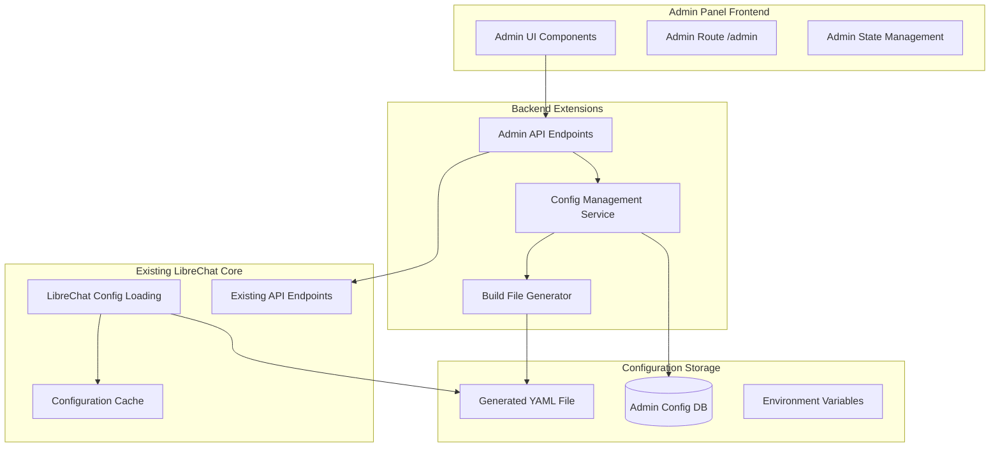

# LibreChat Compile-Time Admin Panel - Project Plan

## Project Overview

This document outlines the implementation plan for a compile-time admin panel that will enable monitoring and configuration management without causing upstream merge conflicts. The solution focuses on utilizing existing API endpoints and implementing a build-time configuration management system.

## Architecture Overview

### Core Concept
- **Compile-Time Configuration**: Settings are modified through a web interface but require application restart to take effect
- **Minimal Core Changes**: New functionality is additive, avoiding modifications to core LibreChat files
- **API-First Approach**: Leverage existing endpoints for monitoring; create minimal new endpoints for configuration
- **Build Process Integration**: Configuration changes trigger YAML regeneration and optional rebuild

### System Components



## Implementation Strategy

### Phase 1: Foundation (Minimal Core Changes)
1. **Admin Route Setup**
   - Create new route `/admin` in client routing
   - Implement admin panel layout and navigation
   - Add admin authentication checks

2. **Database Schema**
   - Create `AdminConfig` model for storing admin-modified settings
   - Design flexible schema to handle various configuration types

3. **Basic API Endpoints**
   - `GET /api/admin/config` - Retrieve current admin configuration
   - `POST /api/admin/config` - Update admin configuration
   - `POST /api/admin/config/apply` - Apply configuration and trigger rebuild

### Phase 2: Monitoring & Analytics
1. **Usage Monitoring**
   - Utilize existing user endpoints for user management
   - Create dashboard views for system metrics
   - Implement real-time usage tracking

2. **System Health**
   - Display configuration status
   - Show cache information
   - Monitor active sessions and performance

### Phase 3: Configuration Management
1. **YAML Generation**
   - Build service to **merge admin overrides without touching the original `librechat.yaml`**
   - Produce a separate overlay file `librechat.admin.yaml` (or `admin-overrides.yaml`)
   - At boot, load base YAML first, then deep-merge the overlay (admin values take precedence)
   - Keep automatic **backup and rollback** for the overlay file, original YAML remains pristine

2. **Plugin Registration**
   - Package the side-car API router as **`@govgpt/librechat-admin`** (published to your private or public npm registry)
   - Export a function: `module.exports = (options) => adminRouter`
   - **Consumers mount** it with:
     ```js
     const adminRouter = require('@govgpt/librechat-admin')({ /* opts */ });
     app.use('/api/admin', adminRouter);
     ```
   - Optional helper could auto-mount if the package is present, but **no edits inside LibreChat core are required**—projects decide whether to include the plugin in `package.json`.

### Phase 4: Advanced Features
1. **Configuration Validation**
   - Pre-apply validation of settings
   - Rollback on failed configurations
   - Configuration versioning

2. **User Management Enhancement**
   - Advanced user analytics
   - Bulk user operations
   - Enhanced permission management

## Code Style Guidelines

### Frontend Standards
- **Component Structure**: Follow existing LibreChat patterns
- **State Management**: Use existing Zustand stores where applicable
- **Styling**: Utilize Tailwind CSS classes matching current design system
- **Types**: Maintain TypeScript strict mode compliance
- **Hooks**: Create reusable hooks following existing patterns (`useAdmin*`)

### Backend Standards
- **File Organization**: Follow existing directory structure under `api/server/`
- **Error Handling**: Use consistent error response format matching existing endpoints
- **Middleware**: Utilize existing middleware (`checkAdmin`, `requireJwtAuth`)
- **Logging**: Follow existing logging patterns using the configured logger
- **Validation**: Use existing validation patterns and schemas

### Database Standards
- **Models**: Follow existing Mongoose model patterns in `api/models/`
- **Naming**: Use camelCase for fields, consistent with existing models
- **Indexes**: Add appropriate indexes for performance
- **Migrations**: Plan for future schema changes

## File Structure and Changes

#### New Packages / Files (all external to upstream source)
```
├── packages/librechat-admin/               # GovGPT admin plugin (npm)
│   ├── index.js                            # exports (opts) => adminRouter
│   ├── router/                             # Express router & route files
│   ├── services/                           # business logic (YAML overlay, metrics…)
│   └── models/AdminConfig.js               # singleton config model
├── admin-frontend/                         # Stand-alone Vite/React project (built to dist/)
└── README-admin.md                         # usage & mounting guide
```

➡  **No modifications** are required inside the upstream LibreChat repository.  Projects that need the dashboard just `npm install @govgpt/librechat-admin` and mount the router.

### Modified Files (single non-intrusive change)

```
└── api/server/index.js      # +2 lines: optional require('admin-api').adminRouter
```

### Configuration Files

```
├── librechat.yaml                                      # Generated/updated by admin
├── librechat.admin.yaml                               # Admin-specific overrides
└── config/admin-defaults.yaml                         # Default admin settings
```

## Implementation Details

### Database Schema

```javascript
// AdminConfig Model
const adminConfigSchema = new mongoose.Schema({
  configKey: { type: String, required: true, unique: true },
  configValue: { type: mongoose.Schema.Types.Mixed, required: true },
  configType: { 
    type: String, 
    enum: ['interface', 'endpoints', 'registration', 'features'],
    required: true 
  },
  updatedBy: { 
    type: mongoose.Schema.Types.ObjectId, 
    ref: 'User', 
    required: true 
  },
  updatedAt: { type: Date, default: Date.now },
  isActive: { type: Boolean, default: true },
  version: { type: Number, default: 1 }
});
```

### API Endpoints

```javascript
// Admin API Endpoints
GET    /api/admin/config                    # Get current admin configuration
POST   /api/admin/config                    # Update admin configuration
DELETE /api/admin/config/:key               # Remove admin configuration
POST   /api/admin/config/apply              # Persist overrides & flag for reboot notification
GET    /api/admin/system/metrics            # Get system metrics
GET    /api/admin/users                     # Get user analytics (uses existing endpoints)
GET    /api/admin/logs                      # Get system logs (future)
```

### Frontend Route Structure

```typescript
// Admin route configuration
const AdminRoute = () => {
  const { user } = useAuthContext();
  
  if (user?.role !== SystemRoles.ADMIN) {
    return <Navigate to="/" replace />;
  }
  
  return (
    <div className="admin-layout">
      <AdminSidebar />
      <AdminContent />
    </div>
  );
};
```

### Configuration Service

```javascript
// YAML Generator Service
class YamlGeneratorService {
  async generateConfig() {
    const baseConfig = await this.loadBaseConfig();
    const adminOverrides = await this.getAdminOverrides();
    const mergedConfig = this.mergeConfigurations(baseConfig, adminOverrides);
    
    await this.writeYamlFile(mergedConfig);
    await this.invalidateCache();
    
    return mergedConfig;
  }
  
  async mergeConfigurations(base, overrides) {
    // Deep merge logic with admin precedence
    return merge(base, overrides);
  }
}
```

## Security Considerations

### Authentication & Authorization
- **Admin Role Validation**: Strict checking of `SystemRoles.ADMIN`
- **Session Management**: Leverage existing JWT authentication
- **API Protection**: All admin endpoints require admin role
- **Audit Logging**: Log every mutation with pre/post diff, user-id and IP address

### Data Protection
- **Explicit Allow-List**: Maintain a hard-coded allow-list of YAML keys that may be edited.  Reject writes to any key outside this list (including provider credentials, JWT secrets, etc.)
- **Input Validation**: Validate all configuration inputs against the schema & allow-list
- **Configuration Backup**: Automatic backup before changes
- **Rollback Mechanism**: Ability to revert configurations

## Maintainability Strategy

### Modular Design
- **Isolated Components**: Admin panel components are self-contained
- **Service Layer**: Business logic separated into service classes
- **API Consistency**: Follow existing API patterns and conventions
- **Type Safety**: Full TypeScript coverage for admin functionality

### Testing Strategy
- **Unit Tests**: Test admin services and utilities
- **Integration Tests**: Test API endpoints with admin auth
- **E2E Tests**: Test complete admin workflows
- **Configuration Validation**: Test YAML generation and validation

### Documentation
- **API Documentation**: Document all new admin endpoints
- **Component Documentation**: JSDoc for admin components
- **Configuration Guide**: Document available admin settings
- **Deployment Guide**: Steps for admin panel deployment

### Future Extensibility
- **Plugin System**: Design for future admin plugins
- **Configuration Schema**: Extensible configuration schema
- **Event System**: Hooks for configuration change events
- **Metrics Framework**: Extensible metrics collection

## Deployment Strategy

### Development Environment
1. Create admin configuration database collections
2. Seed with default admin settings
3. Set up development build process for YAML generation
4. Configure admin user permissions

### Production Deployment
1. **Database Migration**: Create admin configuration collections
2. **Environment Setup**: Configure admin-specific environment variables
3. **Permission Setup**: Ensure first user has admin role
4. **Backup Strategy**: Implement configuration backup before changes
5. **Monitoring**: Set up monitoring for admin configuration changes

### Rollback Plan
1. **Configuration Backup**: Automatic backup before each change
2. **Version Control**: Track configuration versions in database
3. **Quick Restore**: One-click restore to previous configuration
4. **Emergency Reset**: Reset to default configuration if needed

## Migration from Runtime Admin Panel

### Data Migration
- Export existing admin configurations
- Map runtime settings to compile-time equivalents
- Preserve user permissions and roles
- Maintain audit trail of changes

### Feature Parity
- Replicate all existing admin functionality
- Maintain UI/UX consistency
- Preserve workflow patterns
- Add restart notifications for configuration changes

### Transition Strategy
- Phase out runtime configuration gradually
- Provide clear migration documentation
- Offer side-by-side comparison during transition
- Implement configuration validation during migration

## Success Metrics

### Technical Metrics
- Zero merge conflicts with upstream LibreChat
- <2 second configuration application time
- 100% admin functionality coverage
- Zero security vulnerabilities in admin code

### User Experience Metrics
- Intuitive admin interface with <5 minute learning curve
- Clear configuration change impact communication
- Reliable restart and configuration application process
- Comprehensive error handling and user feedback

### Maintainability Metrics
- Modular codebase with clear separation of concerns
- Comprehensive test coverage (>90%)
- Documentation completeness
- Easy integration with future LibreChat updates

---

This compile-time admin panel approach ensures minimal conflicts with upstream LibreChat while providing comprehensive administrative functionality through a clean, maintainable architecture.
